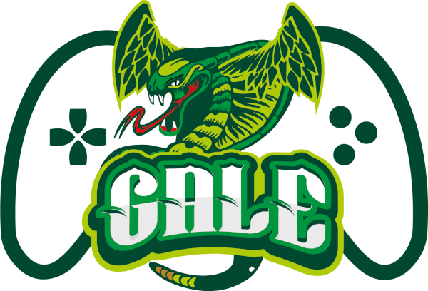

Gale_ is a collection of reusable codes to ease your life when building games
with Python_ and Pygame_.

|Python3| |Pygame| |License| |GithubCommits| |BlackFormatBadge|

Modules
-------
- ``gale.animation``: Contains the class ``Animation``.
- ``gale.frames``: Contains a util function to generate rectangle frames from a sprite sheet.
- ``gale.game``: Contains a base class ``Game`` to be inherited to ease your game building.
- ``gale.input_handler``: Contains key definitions, mouse button definitions, mouse wheel input definitions, mouse move input definitions, classes to store the information about an input, an interface to listen the input handler and the class ``InputHandler``.
- ``gale.particle_system``: Contains classes to handle particle systems in your game.
- ``gale.state_machine``: Contains the class ``BaseState``, a basic class ``StateMachine`` and a basic class ``StateStack``.
- ``gale.text``: Contains a util function to ease text rendering and a class ``Text``.
- ``gale.timer``: Contains classes to handle timers that execute action every x seconds, after x seconds, and tweening.

Installation
------------

::

   pip install https://github.com/R3mmurd/Gale/archive/master.zip


Create a template for your project
----------------------------------

You can organize the source code of your project as you want. However, this library provides
the a command to create a basic template for your project. If you want to use it, you only need
to execute the following command:

::

   gale-admin create-project {project_name}


For instance, if you want to create a project called "my_first_arpg_game", then you should
execute:

::

   gale-admin create-project my_first_arpg_game


It will create a directory with the same name with the following structure:

::

   my_first_arpg_game
   ├── fonts
   ├── graphics
   ├── main.py
   ├── README.md
   ├── settings.py
   ├── sounds
   ├── src
   |   ├── MyFirstArpgGame.py


- ``fonts`` is an empty directory where you should store your font files.
- ``graphics`` is an empty directory where you should store your image files.
- ``sounds`` is an empty directory where you should store your audio files.
- ``README.md`` contains a base README file. It contains the following contents:

::

   # My First Arpg Game


- ``main.py`` is the main program to run your game, it contains the following contents:

::

   """
   This module was autogenerated by gale.
   """
   import settings
   from src.MyFirstArpgGame import MyFirstArpgGame
   
   if __name__ == '__main__':
       game = MyFirstArpgGame(
           "My First Arpg Game",
           settings.WINDOW_WIDTH, settings.WINDOW_HEIGHT,
           settings.VIRTUAL_WIDTH, settings.VIRTUAL_HEIGHT
       )
       game.exec()


- ``settings.py`` contains some contants and the registering of the key escape to quit the game. Its contents is the following:

::

   """
   This module was autogenerated by gale.
   """
   import pathlib
   
   import pygame
   
   from gale import frames
   from gale import input_handler
   
   input_handler.InputHandler.set_keyboard_action(input_handler.KEY_ESCAPE, 'quit')
   
   # Size we want to emulate
   VIRTUAL_WIDTH = 320
   VIRTUAL_HEIGHT = 180
   
   # Size of our actual window
   WINDOW_WIDTH = 1280
   WINDOW_HEIGHT = 720
   
   BASE_DIR = pathlib.Path(__file__).parent
   
   # Register your textures from the graphics folder, for instance:
   # TEXTURES = {
   #     'my_texture': pygame.image.load(BASE_DIR / 'graphics/my_texture.png')
   # }
   TEXTURES = {}
   
   # Register your frames, for instance:
   # FRAMES = {
   #     'my_frames': frames.generate_frames(TEXTURES['my_texture'], 16, 16)
   # }
   FRAMES = {}
   
   pygame.mixer.init()
   
   # Register your sound from the sounds ```folder, for instance:
   # SOUNDS = {
   #     'my_sound': pygame.mixer.Sound(BASE_DIR / 'sounds/my_sound.wav'),
   # }
   SOUNDS = {}
   
   pygame.font.init()
   
   # Register your fonts from the fonts folder, for instance:
   # SOUNDS = {
   #     'small': pygame.font.Font(BASE_DIR / 'fonts/font.ttf', 8)
   # }
   FONTS = {}https://img.shields.io/badge/License-MIT-yellow.svg
   ```

- ``src/MyFirstArpgGame.py`` contains the class to define your game. Its contents is the following:

::
       
   """
   This module was autogenerated by gale.
   """
   import pygame
   
   from gale.game import Game
   from gale.input_handler import InputData, InputHandler, InputListener
   from gale.state_machine import StateMachine
   
   
   class MyFirstArpgGame(Game, InputListener):
       def init(self) -> None:
           self.state_machine = StateMachine()
           InputHandler.register_listener(self)
   
       def update(self, dt: float) -> None:
           self.state_machine.update(dt)
   
       def render(self, surface: pygame.Surface) -> None:
           self.state_machine.render(surface)
   
       def on_input(self, input_id: str, input_data: InputData) -> None:
           if (input_id == 'quit' and input_data.pressed):
               self.quit()

.. |Python3| image:: https://img.shields.io/badge/python-3-blue.svg?v=1

.. |Pygame| https://img.shields.io/badge/pygame-green.svg?v=1
   :target: https://opensource.org/licenses/MIT

.. |License| https://img.shields.io/badge/License-MIT-yellow.svg

.. |GithubCommits| image:: https://img.shields.io/github/commits-since/R3mmurd/Gale/v1.0.0.svg
   :target: https://github.com/R3mmurd/Gale/compare/v1.0.0...main

.. |BlackFormatBadge| image:: https://img.shields.io/badge/code%20style-black-000000.svg
    :target: https://github.com/psf/black

.. _gale: https://github.com/R3mmurd/Gale
.. _python: https://www.python.org/
.. _pygame: https://www.pygame.org
.. _The MIT License: https://opensource.org/licenses