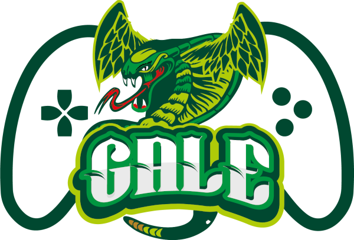

|Python3| |Pygame2| |License| |GithubCommits| |BlackFormatBadge| |CIBadge|


Gale_ is a collection of reusable codes to ease your life when building games with Python_ and Pygame_.


Modules
-------
- ``gale.ai``: Contains a modular toolkit to build autonomous characters: the ``Kinematic`` body and steering behaviors, a behavior tree, a decision tree, and the ``Agent`` class that ties them together.
- ``gale.animation``: Contains the class ``Animation``.
- ``gale.factory``: Contains the classes ``Factory`` and ``Abstract Factory``.
- ``gale.frames``: Contains a util function to generate rectangle frames from a sprite sheet.
- ``gale.game``: Contains a base class ``Game`` to be inherited to ease your game building.
- ``gale.input_handler``: Contains key definitions, mouse button definitions, mouse wheel input definitions, mouse move input definitions, classes to store the information about an input, an interface to listen the input handler and the class ``InputHandler``.
- ``gale.particle_system``: Contains classes to handle particle systems in your game.
- ``gale.state_machine``: Contains the class ``BaseState``, a basic class ``StateMachine`` and a basic class ``StateStack``.
- ``gale.text``: Contains a util function to ease text rendering and a class ``Text``.
- ``gale.timer``: Contains classes to handle timers that execute action every x seconds, after x seconds, and tweening.


Installation
------------

.. code-block:: bash

   pip install https://github.com/R3mmurd/Gale/archive/main.zip


Create a template for your project
----------------------------------

You can organize the source code of your project as you want. However, this library provides
the a command to create a basic template for your project. If you want to use it, you only need
to execute the following command:

.. code-block:: bash

   gale-admin create-project {project_name}


For instance, if you want to create a project called "my_first_arpg_game", then you should
execute:

.. code-block:: bash

   gale-admin create-project my_first_arpg_game


It will create a directory with the same name with the following structure:

.. code-block:: bash

   my_first_arpg_game
   ├── assets
   │   ├── fonts
   │   ├── graphics
   │   └── sounds
   ├── main.py
   ├── README.md
   ├── settings.py
   └── src
      └── MyFirstArpgGame.py


- ``fonts`` is an empty directory where you should store your font files.
- ``graphics`` is an empty directory where you should store your image files.
- ``sounds`` is an empty directory where you should store your audio files.
- ``README.md`` contains a base README file. It contains the following contents:

::

   # My First Arpg Game


- ``main.py`` is the main program to run your game, it contains the following contents:

.. code-block:: python 

   """
   This module was autogenerated by gale.
   """
   import settings
   from src.MyFirstArpgGame import MyFirstArpgGame
   
   if __name__ == "__main__":
       game = MyFirstArpgGame(
           "My First Arpg Game",
           settings.WINDOW_WIDTH, settings.WINDOW_HEIGHT,
           settings.VIRTUAL_WIDTH, settings.VIRTUAL_HEIGHT
       )
       game.exec()


- ``settings.py`` contains some contants and the registering of the key escape to quit the game. Its contents is the following:

.. code-block:: python 

   """
   This module was autogenerated by gale.
   """
   import pathlib
   
   import pygame
   
   from gale import frames
   from gale import input_handler
   
   input_handler.InputHandler.set_keyboard_action(input_handler.KEY_ESCAPE, "quit")
   
   # Size we want to emulate
   VIRTUAL_WIDTH = 320
   VIRTUAL_HEIGHT = 180
   
   # Size of our actual window
   WINDOW_WIDTH = 1280
   WINDOW_HEIGHT = 720
   
   BASE_DIR = pathlib.Path(__file__).parent
   
   # Register your textures from the graphics folder, for instance:
   # TEXTURES = {
   #     "my_texture": pygame.image.load(BASE_DIR / "graphics/my_texture.png")
   # }
   TEXTURES = {}
   
   # Register your frames, for instance:
   # FRAMES = {
   #     "my_frames": frames.generate_frames(TEXTURES["my_texture"], 16, 16)
   # }
   FRAMES = {}
   
   pygame.mixer.init()
   
   # Register your sound from the sounds ```folder, for instance:
   # SOUNDS = {
   #     "my_sound": pygame.mixer.Sound(BASE_DIR, "assets" / "sounds/my_sound.wav"),
   # }
   SOUNDS = {}
   
   pygame.font.init()
   
   # Register your fonts from the fonts folder, for instance:
   # FONTS = {
   #     "small": pygame.font.Font(BASE_DIR / "fonts/font.ttf", 8)
   # }
   FONTS = {}

- ``src/MyFirstArpgGame.py`` contains the class to define your game. Its contents is the following:

.. code-block:: python 
       
   """
   This module was autogenerated by gale.
   """
   import pygame
   
   from gale.game import Game
   from gale.input_handler import InputData, InputHandler, InputListener
   from gale.state_machine import StateMachine
   
   
   class MyFirstArpgGame(Game, InputListener):
       def init(self) -> None:
           self.state_machine = StateMachine()
           InputHandler.register_listener(self)
   
       def update(self, dt: float) -> None:
           self.state_machine.update(dt)
   
       def render(self, surface: pygame.Surface) -> None:
           self.state_machine.render(surface)
   
       def on_input(self, input_id: str, input_data: InputData) -> None:
           if (input_id == "quit" and input_data.pressed):
               self.quit()


Key combos
----------

``gale.input_handler`` also lets you bind a key together with one or more
modifiers (``MOD_SHIFT``, ``MOD_CTRL``, ``MOD_ALT``, and/or ``MOD_META``,
joined with the bitwise or operator ``|``). A binding registered without
modifiers keeps triggering regardless of which ones are held, as long as
there is no more specific combo bound to the same key:

.. code-block:: python

   from gale.input_handler import InputHandler, KEY_s, MOD_CTRL, MOD_SHIFT

   InputHandler.set_keyboard_action(KEY_s, "save", modifiers=MOD_CTRL)
   InputHandler.set_keyboard_action(KEY_s, "save_as", modifiers=MOD_CTRL | MOD_SHIFT)


Building autonomous characters with gale.ai
--------------------------------------------

``gale.ai`` provides small, composable pieces to build autonomous
characters (vehicles, people, animals, or any kind of creature): a
``Kinematic`` body, steering behaviors, a behavior tree, and a decision
tree. They are combined through the ``Agent`` class, but you can also use
each piece on its own.

A wandering agent driven only by a steering behavior:

.. code-block:: python

   from gale.ai.agent import Agent
   from gale.ai.steering import Wander

   agent = Agent(x=100, y=100, max_speed=120)
   agent.set_steering_behavior(Wander(agent.kinematic))

   # In your game loop:
   agent.update(dt)

An agent whose steering is decided by a behavior tree, so it chases a
player when close and wanders otherwise:

.. code-block:: python

   from gale.ai.agent import Agent
   from gale.ai.behavior_tree import Action, BehaviorTree, Condition, Selector, Sequence, Status
   from gale.ai.steering import Kinematic, Pursue, Wander

   player = Kinematic()
   wander = None


   def close_to_player(agent) -> bool:
       return (player.position - agent.kinematic.position).length() < 150


   def chase(agent, dt) -> Status:
       agent.set_steering_behavior(Pursue(agent.kinematic, player))
       return Status.RUNNING


   def patrol(agent, dt) -> Status:
       agent.set_steering_behavior(wander)
       return Status.RUNNING


   agent = Agent(x=0, y=0, max_speed=120)
   wander = Wander(agent.kinematic)
   agent.set_brain(
       BehaviorTree(
           Selector(
               [
                   Sequence([Condition(close_to_player), Action(chase)]),
                   Action(patrol),
               ]
           )
       )
   )

   # In your game loop:
   agent.update(dt)

The same decision could be expressed with a ``DecisionTree`` instead of a
behavior tree:

.. code-block:: python

   from gale.ai.decision_tree import ActionNode, DecisionNode, DecisionTree

   agent.set_brain(
       DecisionTree(
           DecisionNode(
               test=close_to_player,
               true_branch=ActionNode(lambda agent: chase(agent, 0)),
               false_branch=ActionNode(lambda agent: patrol(agent, 0)),
           )
       )
   )

Since ``Agent`` accepts ``x`` and ``y`` as its first two constructor
arguments, it plugs directly into ``gale.factory.Factory``:

.. code-block:: python

   from gale.ai.agent import Agent
   from gale.factory import Factory

   agent_factory = Factory(Agent)
   agent = agent_factory.create(50, 50, {"max_speed": 150})


Development
-----------
To work on this library, install the development dependencies, which include
the runtime dependencies plus ``pytest`` and ``pre-commit``:

.. code-block:: bash

   pip install -r requirements-dev.txt

Then install the git hook so that ``black`` and the test suite run
automatically before every commit:

.. code-block:: bash

   pre-commit install

You can also run both checks manually at any time:

.. code-block:: bash

   black .
   pytest

Every push and pull request against ``main`` or ``develop`` also runs these
same checks through GitHub Actions (see ``.github/workflows/ci.yml``).


Contributors
------------
.. image:: https://contrib.rocks/image?repo=R3mmurd/Gale
   :target: https://github.com/R3mmurd/Gale/graphs/contributors


Dependencies
------------
Gale is obviously strongly dependent on Python and Pygame. It also depends on the
library Click for our command line implementation.


License
-------

This library is distributed under `the MIT License`_, which can
be found in the file ``LICENSE``.  We reserve the right to place
future versions of this library under a different license.

See docs/licenses for licenses of dependencies.


.. |Python3| image:: https://img.shields.io/badge/python-3-blue.svg?v=1
   :target: https://docs.python.org/3/

.. |Pygame2| image:: https://img.shields.io/badge/pygame-green.svg?v=1
   :target: https://www.pygame.org/docs/

.. |License| image:: https://img.shields.io/badge/License-MIT-yellow.svg
   :target: https://opensource.org/licenses/MIT

.. |GithubCommits| image:: https://img.shields.io/github/commits-since/R3mmurd/Gale/v1.2.0.svg
   :target: https://github.com/R3mmurd/Gale/compare/v1.2.0...main

.. |BlackFormatBadge| image:: https://img.shields.io/badge/code%20style-black-000000.svg
    :target: https://github.com/psf/black

.. |CIBadge| image:: https://github.com/R3mmurd/Gale/actions/workflows/ci.yml/badge.svg
    :target: https://github.com/R3mmurd/Gale/actions/workflows/ci.yml

.. _gale: https://github.com/R3mmurd/Gale
.. _Python: https://www.python.org/
.. _Pygame: https://www.pygame.org
.. _The MIT License: https://opensource.org/licenses
